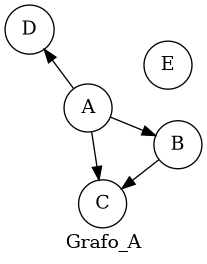

# DSL: Grafos dirigidos y no dirigidos #
## Descripcion ##
### Idea general ###
El presente lenguaje de dominio especifico pretende facilitar el uso de grafos con una implementación orientada a la definición matemática de grafos, es decir
un grafo es una tupla G = (V,E) donde V es el conjunto de vértices y E el conjunto de aristas definido como (a,b) con a y b vértices. Esto se hizo utilizando
la estructura Set de Haskell
### Alcances ###
Es posible definir y facilitar el uso de grafos de gran magnitud y hacer operaciones básicas entre ellos como union, intersección, diferencia, complemento y más.
Además el enfoque principal del programa es encontrar fácilmente ciclos hamiltonianos y circuitos/caminos eulerianos con un algoritmo de backtracking (debido a que estos problemas son 
categorizados como NP-completos).

## Dependencias ##
Para poder compilar el programa debera contar con un compilador de *Haskell*, *Stack* y la libreria *GraphViz*
Para instalar la libreria *GraphViz*:
```shell
sudo apt install graphviz
```
## Manual de uso ##
### Instrucciones de compilacion ###
#### Generacion de parser ####
Si por alguna razon desea modificar el modulo de parseo, debera contar con la herramienta de generacion de parsers *Happy*.
Para instalar dicha herramienta en *Ubuntu* puede utilizar la instruccion:
```shell
sudo cabal install happy
```
Una vez instalada, puede modificar el archivo *Parser.y* y luego generar el parser mediante la instruccion:
```shell
happy Parser.y
```
#### Programa principal ####
Para compilar el programa utilizaremos stack 
```shell
stack build
```
Luego, simplemente podemos correr el programa

```shell
stack run [FILE]
```

## Definicion de grafos ##
### Definicion de representaciones ###
Los archivos deben ser guardados en formato *.gr*, la definicion de un grafo puede ser evaluado escribiendolo con la sintaxis o guardarse en el entorno. En ambos casos la notación es la siguiente: <br>
Sea A_n y B_n nodos con cualquier nombre alfanumérico que desee asignarse. <br>
### Grafos dirigidos 
Se define todas las aristas que van desde A1 hacia otros nodos y luego se finaliza con un *;* para pasar a la definición de las aristas salientes del siguiente nodo (B1) <br>
{ A1 -> A2 A3 .. ; B1 -> B2 B3 .. ; .. ;} <br>
### Grafos no dirigidos <br>
Se define todas las aristas de A1 y luego se finaliza con un *;* para pasar a la definición de las aristas del siguiente nodo (B1) <br>
{ A1 -- A2 A3 .. ; B1 -- B2 B3 .. ; .. ;} <br>
<br>

### Información adicional

Es posible definir el grafo vacío simplemente con {}, en los demás casos siempre debe finalizarse la definición de las aristas de un nodo con un ; <br>
En ambos casos (dirigidos y no dirigidos) para definir un nodo aislado se debe agregar "--" o "->" sin ningún nodo a la derecha, por ejemplo <br>
{A ->;} <br>
Para guardar un grafo en el entorno, se debe utilizar la siguiente notación: <br>
def NOMBRE_VAR = { A1 -> A2 A3 .. ; B1 -> B2 B3 .. ; .. ;} <br>
Un ejemplo de un grafo puede ser: <br>
<br>
def Grafo_A = {A ->B C D;B -> C;E -> ;} <br>
 <br>

## Ploting y visualización del grafo ##
Para mostrar los grafos se utiliza la librería GraphViz el cual transforma nuestra representación al formato DOT y luego
produce la salida en PNG en *images/NAME.png* con el nombre que se le definió al grafo, si es una evaluación de un grafo sin nombre se le asigna
el nombre predeterminado "Graph" y se puede observar en *images/Graph.png*
Cuando se utiliza el programa en modo interactivo desde la consola, los grafos se iran enseñando mediante el ploting de GraphViz, el cual abrirá una ventana
con el grafo en cuestión y no se podrá seguir utilizando el modo interactivo hasta cerrar dicha ventana, luego se produce la salida dentro de la carpeta images como se
ha dicho anteriormente. Para la operación de componentes conexas el programa mostrará por consola el resultado numérico.

## Operaciones básicas entre grafos##
Las operaciones binarias entre grafos están definidas siguiendo el modelo matemático.
Sea A y B nombres de los grafos definidos en el entorno o grafos definidos con la sintaxis
Unión de grafos: A \/ B
Intersección de grafos: A /\ B
Diferencia entre grafos: A - B
Complemento de un grafo: !A
Cantidad de componentes conexas de un grafo: K A

## Algoritmos de búsqueda de grafos hamiltonianos y eulerianos ##
Con el programa podemos encontrar ciclos hamiltonianos y circuitos/caminos eulerianos, los cuales se mostraran en rojo en el grafo y con el orden numérico
de donde empieza y termina dicho camino. Si el grafo no es hamiltoniano o euleriano, no se enseñará ningún camino indicando que no existe.
Euler A
Hamilton A

### Gramatica ###
La siguiente gramatica define formalmente el lenguaje:
```
DEF    ::= Def 'NAME' = EXP
         | EXP

EXP ::=  NAME
      | { DEFGRAPH }
      | ( EXP )
      | EXP \/ EXP
      | EXP /\ EXP
      | EXP - EXP
      | !EXP
      | K EXP
      | Euler EXP
      | Hamilton EXP

DEFGRAPH ::= ATOM -> EDGES ; DIRECTEDGR
           | ATOM -- EDGES ; UNDIRECTEDGR
	   | 


ATOM ::= NAME
        | INT
        |

DIRECTEDGR ::= ATOM -> EDGES ; DIRECTEDGR
             |

UNDIRECTEDGR ::= ATOM -- EDGES ; UNDIRECTEDGR
               |

EDGES ::= ATOM EDGES
        | 

DEFS ::= DEF DEFS
       | 

```

### Ejemplos ###
La carpeta *Ejemplos* contiene definiciones de grafos populares como el de Petersen, K3,K4,K5 y K3,3 como también un ejemplo del uso de las operaciones.
## Informacion adicional ##
### Distribucion de modulos ###
Con el fin de facilitar el mantenimiento y lectura del codigo fuente, se ha decidido separar el codigo en los siguientes modulos:

graph/ <br>
│── app/                  
│   ├── Main.hs           #Es el modulo principal del programa que se encarga de llevar el entorno y el modo interactivo. <br>
│── src/ <br>
│   ├── Common.hs         #Es el modulo donde estan definidas las estructuras principales, AST y términos del grafo y sus propiedades. <br>
│   ├── DirectedG.hs      #Es el módulo que contiene las funciones exclusivas para los grafos dirigidos <br>
│   ├── UnDirectedG.hs    #Es el módulo que contiene las funciones exclusivas para los grafos no dirigidos <br>
│   ├── Parse.y           #Es el módulo en formato happy que se encarga de armar la gramática del grafo y convertirlo en un término superficial <br>
│   ├── Elab.hs           #Es el módulo que se encarga de elaborar los términos superficiales del parser a términos <br>
│   ├── Eval.hs           #Es el módulo que se encarga en evaluar los términos a una estructura Value que puede ser un grafo o un entero<br>
│   └── PrettyPrinter.hs  #Es el módulo que se encarga del ploting del grafo y de producir la salida de la evaluación a PNG <br>
│── images/               #Carpeta donde se guarda la salida del programa en formato PNG, hay algunos incluidos de ejemplo <br>
└── Ejemplos/             #Ejemplos de programas escritos con Graphs, con extensión .gr <br>

### Decisiones de diseño ###
#### Librería *GraphViz* y *Data.Graph* ####
Antes de utilizar GraphViz se intentó utilizar otras librerías como diagrams, repa y fgl pero no daban el resultado esperado. Luego cuando se optó por GraphViz
se vió una sintaxis más clara y adecuada para el proyecto. También fue necesario adoptar la estructura intermedia de Data.Graph ya que
es en la que está definida GraphViz para ser transformado a DOT.

#### Libreria *Data.Set* ####
La representación del grafo primero fue con listas, pero al decidir llevarlo a un enfoque más matemático (es decir, trabajar con conjuntos) se optó la opción
de representar todo con conjuntos, lo que mejoró el performance y optimizó las funciones ya que el costo de de inserción, eliminación, union, intersección y demás
es menor debido a que está implementado con un Árbol Binario Balanceado Red-Black Tree. [Para más información](https://hackage.haskell.org/package/containers-0.7/docs/Data-Set.html)

#### Algoritmos de Hamilton ####
Como ya se dijo anteriormente, este es un problema NP-Completo y no existe un algoritmo eficiente conocido que no incluya heuristicas complejas
por lo que se optó a un algoritmo de backtracking incluyendo la mayoría de los casos.

### Bibliografia ###
Para mayor conocimiento, puede consultar los siguientes articulos de *Wikipedia* referidos a los grafos y las propiedades implementadas:

- [Grafos](https://es.wikipedia.org/wiki/Grafo)
- [Grafos conexos](https://es.wikipedia.org/wiki/Grafo_conexo)
- [Ciclos Eulerianos](https://es.wikipedia.org/wiki/Ciclo_euleriano)
- [Caminos Hamiltonianos](https://es.wikipedia.org/wiki/Camino_hamiltoniano)

Como también la documentación de las herramientas y estructuras utilizadas:

- [Happy](https://www.haskell.org/happy/doc/html/sec-using.html)
- [GraphViz](https://hackage.haskell.org/package/graphviz-2999.11.0.0/docs/Data-GraphViz.html)
- [Data.Set](https://hackage.haskell.org/package/containers-0.7/docs/Data-Set.html)
- [Data.Graph](https://hackage.haskell.org/package/containers-0.7/docs/Data-Graph.html)

### Acerca del autor ###
Mi nombre es Lautaro Peralta Aguilera, soy estudiante de quinto año de la carrera de Licenciatura en Ciencias de la Computacion en la Facultad de Ciencias Exactas, Ingenieria y Agrimensura de la ciudad de Rosario.

Este trabajo fue presentado en el marco de la catedra de Analisis de Lenguajes de Programacion.
